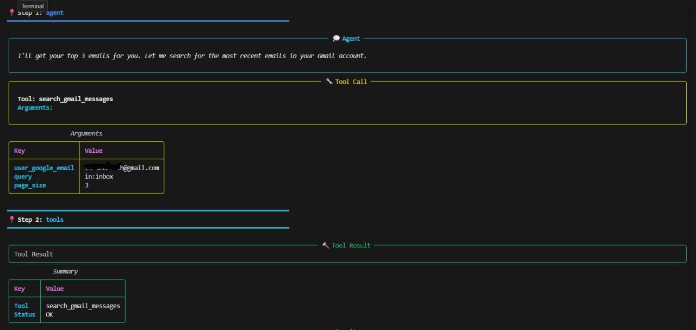
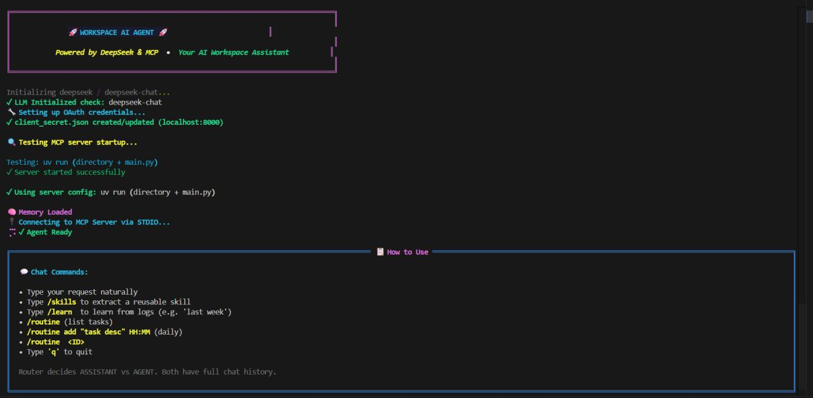

# Workspace AI Agent

An action-oriented AI assistant that routes between a general chat mode and a tool-enabled agent mode for real work. Built on LangGraph and LangChain with Google Workspace integration via an MCP (Model Context Protocol) server.

The goal of this project is simple: move from "AI that talks" to "AI that executes" across your workspace and local environment.




Screenshots of the terminal UI. Streamlit UI is still in progress.

## How this helps

- Reduce manual busywork by letting the agent execute multi-step tasks.
- Keep context and preferences in memory so you do not repeat yourself.
- Combine multiple LLM providers under one interface, choosing the right model for the task.
- Automate recurring routines (summaries, housekeeping, scheduled tasks).

## Key features

- Action routing: decides between safe "assistant" responses and tool-enabled "agent" execution.
- Google Workspace automation via MCP tools (Gmail, Drive, Calendar, Docs, Slides, Sheets).
- Local system tooling through a terminal tool (file ops, scripts, data transforms).
- Local workspace search via `/search` with BM25 and embedding retrieval.
- Multi-provider LLM support (OpenAI, Anthropic, Google Gemini, DeepSeek).
- Memory and conversation history persistence.
- Routine scheduling and reusable workflows.
- Extensible architecture built on LangGraph and LangChain.

## Tools and integrations (what you can actually do)

The agent exposes a growing tool belt through MCP and local system tools. Examples below are representative of the current capabilities and intended use cases.

### Google Workspace tools (via MCP)

These let the agent read and create Workspace content, manage documents, and coordinate schedules:

- Gmail: search threads, read metadata, summarize emails, and organize findings.
- Google Drive: list files/folders, organize files, and retrieve document context.
- Google Calendar: create and manage events, check availability, and schedule meetings.
- Google Docs: create docs, add structured content (notes, agendas, summaries), and update existing files.
- Google Sheets: create sheets, write structured data, and generate reports from CSVs.
- Google Slides: create presentations, insert structured content, and build decks from outlines.

### Local system tools

Use these for on-device work that supports workspace tasks:

- File operations: rename, move, organize, and inspect local files.
- Data processing: run scripts to transform CSVs/JSON and prepare reports.
- Command execution: run terminal commands for automation or analysis.

### AI model providers

Switch providers based on cost/performance or task complexity:

- OpenAI (general reasoning plus tool orchestration)
- Anthropic (long-form reasoning and planning)
- Google Gemini (strong general reasoning)
- DeepSeek (fast cost-efficient reasoning)
- Qwen3-4B Distilled (local single-file model, currently testing/WIP)

## Common use cases

- "Summarize unread emails and draft a status update doc."
- "Organize Drive by project and generate a slide deck summary."
- "Schedule a team sync next week and create the agenda."
- "Merge multiple CSVs and output a formatted sheet with charts."
- "Scan a folder, clean filenames, and produce a report."

## Project layout (high level)

- `main.py`: primary CLI/terminal agent entry point.
- `app.py`: Streamlit UI scaffold (currently commented out).
- `routines.py` / `artifacts/routines.json`: routine definitions and runner.
- `conversations/`: stored chat logs.
- `artifacts/memory.txt`: lightweight long-term memory for user preferences.
- `artifacts/error_history.txt`: past error solutions.
- `artifacts/best_practices.txt`: learned best practices.
- `.env.example`: environment variable template.
- `setup/`: setup scripts and Docker assets.

## Requirements

- Python 3.11+ (3.11 is tested in the Docker image).
- `uv` (fast Python package manager).
- Access to at least one supported LLM provider.
- A local clone of the Google Workspace MCP server.

## Quick start (local)

### 1) Install `uv`

```bash
pip install uv
```

### 2) Install dependencies

```bash
uv sync
```

### 3) Configure environment

Copy the template and fill in credentials:

- Windows:
  ```powershell
  copy .env.example .env
  ```
- macOS/Linux:
  ```bash
  cp .env.example .env
  ```

Minimum required values:

- `OPENAI_API_KEY` (or another provider API key below)
- `USER_GOOGLE_EMAIL`
- `GOOGLE_OAUTH_CLIENT_ID`
- `GOOGLE_OAUTH_CLIENT_SECRET`

Optional provider keys:

- `ANTHROPIC_API_KEY`
- `GOOGLE_API_KEY` or `GEMINI_API_KEY`
- `DEEPSEEK_API_KEY`

### 4) Point to the MCP server

This project expects a local clone of the Google Workspace MCP server. Update the path in `main.py` to where you cloned it:

```python
MCP_SERVER_PATH = Path(r"C:\path\to\google_workspace_mcp")
```

### 5) Run the agent

```bash
uv run main.py
```

## Setup (WIP)

Local model setup and related scripts are evolving. The goal is to support fully local, single-file model runs without external services. Expect changes to file locations and startup commands while this is being stabilized.

Local workspace search is being expanded. The `/search` command supports BM25 and embedding retrieval to find content across the local workspace, and indexing behavior may change as this matures.

## Qwen3-4B Distilled (WIP)

Support for Qwen3-4B Distilled is in progress and currently under test. The model is intended to run fully locally from a single file, with no external network calls.

## Run with Docker

Use the provided script (Windows):

```powershell
.\setup\run_docker.bat
```

Or build and run manually:

```bash
docker build -t workspace-agent -f setup/Dockerfile .
docker run -it --rm --env-file .env -p 8501:8501 -p 8080:8080 workspace-agent
```

Notes:

- The Docker image clones the MCP server automatically into `/app/mcp-server`.
- The container runs Streamlit by default (see `Dockerfile`). If you want the CLI agent inside the container, run `python main.py` in a shell after the container starts.

## Usage tips

- Start with small requests and confirm authentication when prompted.
- The agent will return an authorization URL when Google auth is required. Complete the browser flow, then rerun the same command.
- If a provider key is missing, switch to another provider or add the key in `.env`.

## Troubleshooting

- Missing API key errors: check `.env` and reload your shell.
- Google auth errors: ensure `GOOGLE_OAUTH_CLIENT_ID` and `GOOGLE_OAUTH_CLIENT_SECRET` are correct and that OAuth consent is configured.
- MCP server errors: confirm the MCP server path in `main.py` and that its dependencies are installed.

## Roadmap (high level)

- Broader workspace integrations (project management tools).
- More robust UI for managing routines and memory.
- Improved safety guardrails and policy enforcement.

## Privacy

- By default, the agent stores local conversation logs and memory files under `conversations/` and `artifacts/`.
- Local model testing is intended to keep inference fully on-device when enabled.
- Review and clear local files if you handle sensitive data.

## Links

- LinkedIn profile: https://www.linkedin.com/in/uaz-3059
- LinkedIn post: https://www.linkedin.com/posts/uaz-3059_ai-automation-productivity-ugcPost-7418702316628979712-oALo

---
